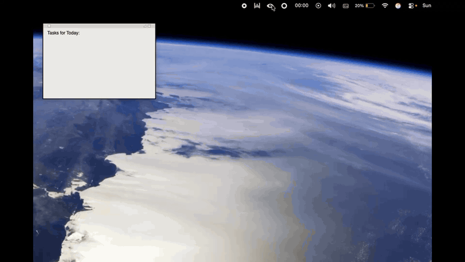
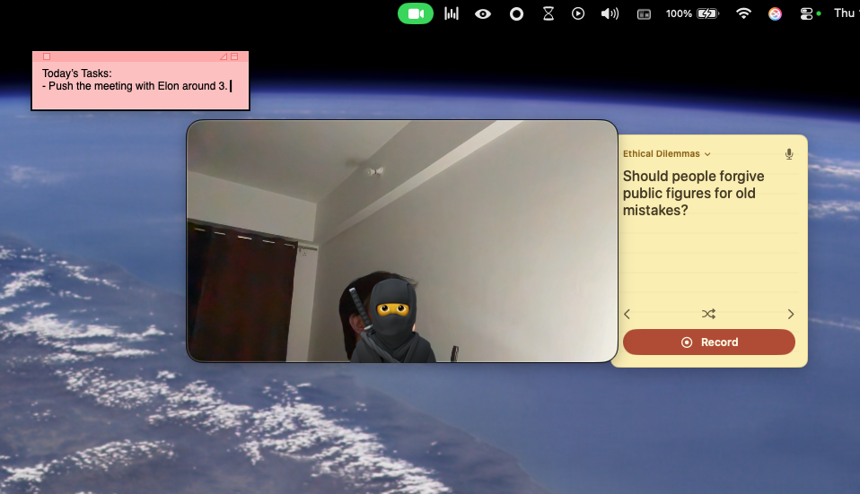

# SelfCam

A native macOS **menu-bar camera utility**. Click the icon, see yourself, fix your hair before
the call — then open **Table Topics** and practise speaking to it. Built with Swift + SwiftUI +
AppKit + AVFoundation. No dependencies, no build tooling beyond Xcode.

<table>
  <tr>
    <td width="50%" align="center">
      
    </td>
    <td width="50%" align="center">
      
    </td>
  </tr>
  <tr>
    <td align="center">
      <sub><b>The mirror</b> — click the icon and the camera emerges from the menu bar; drag it
      off to detach, then pick a size and shape.<br><a href="docs/selfcam-demo.mp4">Full-quality video ↓</a></sub>
    </td>
    <td align="center">
      <sub><b>Table Topics</b> — a speaking prompt, a 3-2-1 countdown and a recorder,
      docked beside the camera. Takes are saved to <code>~/Movies/SelfCam</code>.</sub>
    </td>
  </tr>
</table>

## Features

- **Menu-bar mirror** — left-click the icon, the camera window emerges from the menu bar
  (it powers the camera on only while open; closing it turns the camera off).
- **Drag to detach** — drag the window anywhere and it becomes a floating, always-on-top
  window. Hover for a ✕ to close.
- **5 fixed 16:9 sizes** (clamped to your screen), and **shape masks**: rounded, circle, square.
- **Zoom 1×–3×** (software: scales the preview and centre-crops snaps).
- **Camera picker + mirror toggle** (works with built-in, external, and Continuity Camera).
- **Snaps** — capture a still, mark it up with a marker, and save to `~/Pictures/SelfCam`
  (location configurable). A popover shows the 5 most recent.
- **Table Topics** — impromptu speaking practice. A sticky note docks beside the camera with
  a prompt drawn from a 1,164-topic deck (15 categories, filterable), then records your take
  after a 3-2-1 countdown. The timer is Toastmasters-paced — green under a minute, amber to
  90 s, red past it. Nothing saves until you press Save, and **Recent Clips** plays back the
  five newest without leaving the menu bar.
- **Notch trigger** — on notched MacBooks, click the notch to toggle the window.
- **Custom menu-bar icon**, and **Launch at Login**.

Everything except the live window lives in the **right-click menu** or the **Settings** window.

### Where things are saved

Everything stays on your Mac — there is no account, no sync, and no network access.

| What | Where |
| --- | --- |
| Snaps | `~/Pictures/SelfCam` (configurable in Settings) |
| Table-topic recordings | `~/Movies/SelfCam/Recordings` — a `.mov` plus a small `.json` sidecar |
| Your topic deck | `~/Movies/SelfCam/topics.json` — plain JSON, safe to hand-edit |

The deck is seeded from a bundled list the first time you open Table Topics. After that the
file on disk wins, so edits stick and your rotation is never reset. Prompts are drawn
least-used-first, so the deck cycles fully before anything repeats.

## Install

Download the latest `SelfCam-<version>.dmg` from the
[Releases page](https://github.com/saishmalunde8/SelfCam/releases), open it, and drag
**SelfCam** onto **Applications**. Launch it from Applications and allow camera access when
prompted. There's no Dock icon — it lives in the menu bar; **Quit** is in the right-click menu.
Microphone access is asked for separately, and only when you tap the mic icon in Table Topics.

> **First launch:** SelfCam isn't notarized by Apple yet, so macOS shows a warning the first
> time. To open it: **right-click the app → Open → Open**, or go to **System Settings →
> Privacy & Security** and click **Open Anyway**. Only needed once.

## Build from source

Open `SelfCam.xcodeproj` in Xcode 16 and press **⌘R**. The app has no Dock icon — it lives
in the menu bar. **Quit** is in the right-click menu.

**First time:** Select the SelfCam target → Signing & Capabilities → set **Team** to your
Apple ID ("Personal Team"), then run and allow camera access when prompted.

**Headless build:**
```bash
DEVELOPER_DIR=/Applications/Xcode.app/Contents/Developer \
  xcodebuild -project SelfCam.xcodeproj -scheme SelfCam \
  -configuration Debug -destination "platform=macOS" build
```

## Architecture

Single-window menu-bar agent. `AppDelegate` builds the object graph at launch; `AppController`
(`@MainActor`) is the coordinator and settings source of truth, owning `CameraManager` (the
reference-counted `AVCaptureSession`), `SnapStore` (on-disk snaps), the `NSPanel`-based camera
window, the notch catcher, and the Settings / Snaps-gallery controllers.

Table Topics layers onto that: `TopicStore` owns the deck and its rotation, `RecordingManager`
owns the `idle → countdown → recording → pendingSave` state machine, and `ClipWriter` commits a
finished take — moving the `.mov` into place first and writing its `.json` sidecar **last**, so
a half-written take never reads as a real clip. `NotePanel` hosts the note as a *child window*
of the camera panel, which is what makes it glide along when you drag the camera around. The
movie and audio outputs attach when Table Topics opens rather than when you press Record, so
Record never reconfigures a running session (which used to blank the preview for a frame).

New `.swift` files added to `SelfCam/` are compiled automatically (Xcode file-system-synchronized
group) — no project edits needed.

## Requirements

macOS 14+, Xcode 16+. Not sandboxed (Hardened Runtime + camera and audio-input entitlements).

> Under Hardened Runtime the microphone needs `com.apple.security.device.audio-input`. The App
> Sandbox key `com.apple.security.device.microphone` is silently ignored here — with only that
> one set, the camera works and audio is denied without ever prompting.
